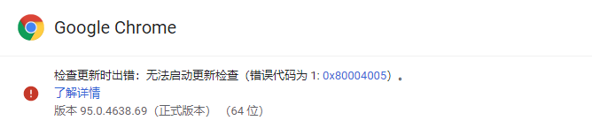

# 洛谷题目下载

在这里，可以批量下载洛谷的题目

## 项目环境

* python 3.10
* mysql 8.0

### 使用的程序

* python文件及运行 -> Pycharm
* sql文件及数据库处理 -> DataGrip

## 使用

* 克隆项目
* 安装相关库

```commandline
pip install bs4
pip install openpyxl
pip install urllib
pip install selenium
pip install pymysql
pip install sqlalchemy
pip install pandas
```

* 安装谷歌浏览器驱动
  此外，如果没有安装谷歌浏览器的驱动，请前往<https://chromedriver.storage.googleapis.com/index.html>寻找自己的谷歌浏览器版本号下载相应的驱动下载，并吧其添加到系统环境变量
	* 确定谷歌浏览器版本
	  在浏览器输入<chrome://settings/help>，如下图，即可知道版本号
	  

* 配置数据库
	* 来到sql目录下，在命令行进入mysql
	  `mysql -u 'username' -p`
	* 插入数据

  ```mysql
  source table_create.sql;
  source insert_tags.sql;
  ```

* 输入数据库信息
  在主目录创建config.py文件，按照以下格式输入数据库信息。

```toml
USE_MYSQL = true           #是否使用数据库，是填true，否填false，如果填false，后面可不填
HOST = "localhost"
PORT = 3306
USER = "root"
PASSWORD = "admin123456"

```

## 版本说明

v1.0 仅可下载主题库的  
v1.1 可以下载除了AtCoder的题目  
v1.2 可以继续上次的下载  
v1.3 继续下载时可以跳过之前下载不成功（没有这题）的题目  
v1.3.2 修改了v1.3的一个bug  
v1.4 可以更改保存目录  
v1.5 网络错误会有提醒，而不是直接退出  
v1.6 优化了一下格式  
v2.1 可以根据网页下载题目（不会出现下载不存在的题）  
v2.2 修改了一下，变成了多文件  
v2.3 修改了一个bug，更新了一下显示格式（显示当前在爬取哪一页）  
v2.4 可以爬取题目信息并分别保存为xlsx工作表的形式  
v2.5 简化了一下程序  
v2.6 改进了一下程序，加快运行速度  
v2.7 添加了一个下载完之后更新的程序（用于检查是否有新的题目）  
v3.1 可以将题目数据加载到MySQL数据库中
v3.2 修改了一下格式，并将配置文件从python文件转为toml文件，更简单

## 数据库说明

一共有3个数据库，分别为tags,problems,tags_problems_link。

* tags tags用来存储每个标签对应的id号，方便搜索
* problems problems用来存储每一道题对应的题号、题目名称和难度
* tags_problems tags 相当于中间关系表，将标签和题目连起来

## 参考资料

在以上的版本中，有些参考了下面两篇博客的程序  
[用python+selenium库爬洛谷题库（人生第一个爬虫）](https://blog.csdn.net/CrazyGuo2000/article/details/105598844)  
[【python爬虫】爬取洛谷习题并转为md格式](https://blog.csdn.net/qq_38243831/article/details/108909442)  
